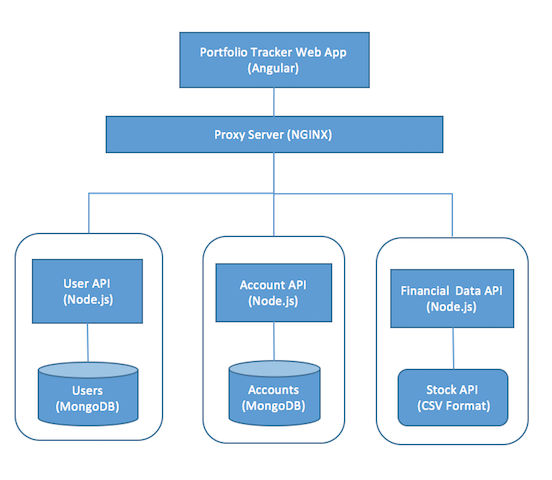

# Portfolio Tracker

This project is a work in progress. Features implemented so far are listed below:

* Basic User management (create, update, change password)
* Create and maintain Portfolio which holds a list of stocks (Holding)
* Add and maintain Holdings within a Portfolio
* For a given Holding Entry, display the following fields: 
  * Stored: symbol, number of shared, purchase date, purchase price, commission
  * Calculated on demand: current stock price, gain/loss
* Retrieve Detailed Stock Quote(s) for one or more symbols
* Retrieve Historical Stock Quote for a given symbol
* PLot Stock Price Chart

---------------------------------------
### Microservice Architecture (MEAN Stack) ###

* user-management-api: manages users
* account-management-api: manage user accounts
* finance-api: retrieve financial data
* portfolio-tracker-web - web application to be developed

---------------------------------------
### API Project Directory Structure ###
    XX-api
      |- config (environment-specific configurations, such as MongoDB connection, JWT parameters)
      |- routes (define routes for endpoints)
      |- controllers (implement endpoint logic)
      |- models (define mongoose schemas)
      |- app.js (initialize Express components and connect to database)
      |- server.js (application starting point)

---------------------------------------
### Generate Swagger for API Projects ###
* Run "grunt swagger-docs" to generate swagger docs for each API project
* Swagger Home Page
  * [user-management-api](http://localhost:3001/user-management/api/docs)
  * [account-management-api](http://localhost:3002/account-management/api/docs)
  * [finance-api](http://localhost:3003/finance/api/docs)
* To execute secured endpoints, at the top of swagger home page, enter admin/admin and click "Set Token" to authenticate once

---------------------------------------
### Build & Run API Projects Locally ###
* Build: npm install
* Edit "config/config.js" to point to the desired Database
* Run "/scripts/init.js" to create and seed database
* Run "node server"
* API Base URL: 
  * user-management-api: http://localhost:3001/user-management/api
  * account-management-api: http://localhost:3002/account-management/api
  * finance-api: http://localhost:3003/finance/api

---------------------------------------
### Deploy and Run Microservices using NGINX ###
* Install NGINX
* copy '/scripts/nginx.conf' to your local installation (ex: /usr/local/etc/nginx/nginx.conf)
* Start each API by running "node server" or "nodemon server"
* Start NGINX (ex: "sudo nginx")
* All API's can be accessed without port number
  * User Management: http://localhost/user-management/api/docs
  * Account-Management: http://localhost/account-management/api/docs
  * Financial Data: http://localhost/finance/api/docs

---------------------------------------
### Microservice Implementation Overview ###
The microservices are implemented with Express using Token-based security, the following node modules are used:
* Common utils used by all API's: https://github.com/bchan01/common-api-utils
* bcrypt for password encryption
* jsonwebtoken to generate and verify JWT token
* mongoose to handle MongoDB persistence
* Q to handle Async callbacks
* lodash for utilities functions
* papaparse for converting CSV to JSON
* reqquest to make HTTP requests to external services
* grunt swagger-docs for generating swagger

